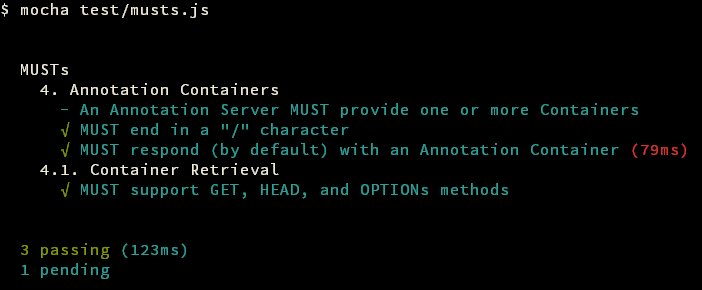

[](https://github.com/bigbluehat/web-annotation-protocol-tester)

# Web Annotation Protocol Test Client

This is an **experimental** test client for the
[Web Annotation Protocol](https://www.w3.org/TR/annotation-protocol/).

### Usage

```
$ npm i -g mocha
$ npm i
$ npm test # runs MUST & SHOULD tests
$ # or
$ npm run musts
$ npm run shoulds
```

Alternatively (if you don't like the massive node stack trace mess...):

```
$ mocha tests/musts.js
$ # or
$ mocha tests/shoulds.js
```

Additionally, you can run specific tests by using mocha's built in grep feature:

```
$ mocha tests/musts.js -g PUT
```

### Screenshot



### License

MIT
